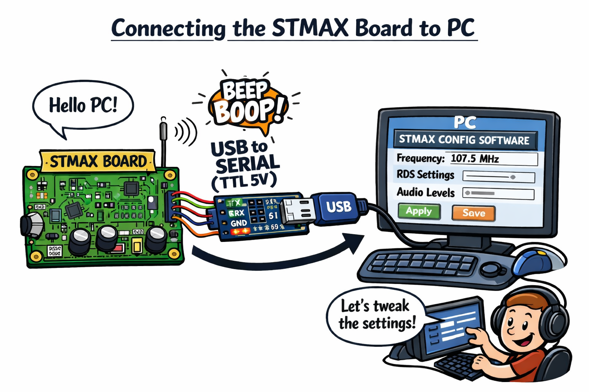
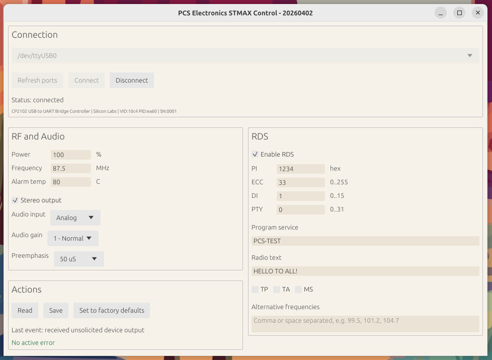
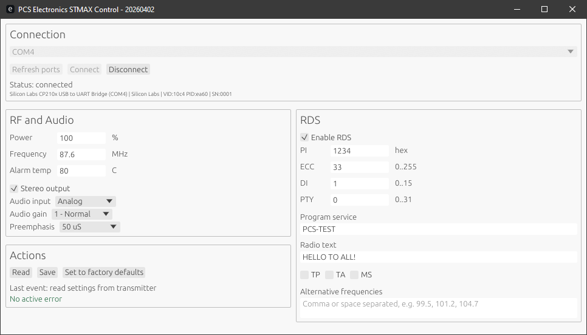

# stmax-gui

Native Rust desktop application for configuring PCS Electronics STMAX transmitters over a serial port.

> Notice: This project was built with GPT-5.4.
>
> Linux and Windows versions are available from the latest release:
> https://github.com/pcs-electronics/stmax-gui/releases/latest



## Features

- Native `tokio + egui` desktop UI for Linux and Windows
- Serial port discovery with USB summaries
- Direct support for the STMAX `config-*` protocol at `115200` baud
- `Read`, `Save`, and `Set to factory defaults` actions
- Host-side validation for power, frequency, alarm temperature, RDS fields, and AF lists
- Automatic settings readback after connect, save, and factory reset
- Inline status and validation feedback in the main window

## Hardware Setup

This application is intended for a stand-alone STMAX exciter board connected directly to a computer through a USB-to-Serial adapter with TTL 5 V levels.

No LCD controller board is required. The GUI replaces the LCD-side configuration interface, so only the exciter board itself needs to be connected.

## Device Protocol


- Commands are newline-terminated text
- Baud rate is `115200`
- `?` returns the firmware help plus the `Current settings:` block
- `config-save` persists the current in-memory values to EEPROM
- `config-defaults` restores factory defaults in RAM

When you press `Save`, the app sends the edited `config-*` fields first and only then sends `config-save`.

## Project Layout

- `src/main.rs`: native entrypoint
- `src/app.rs`: egui application shell and UI
- `src/serial.rs`: async serial controller, port enumeration, request/response handling
- `src/protocol.rs`: STMAX form model, response parser, and command validation
- `build.rs`: build date stamping for the window title
- `build-linux.sh`: locked Linux release build helper
- `build-windows.sh`: locked Windows GNU release build helper

## Requirements

- Rust toolchain with Cargo
- A supported serial driver for the STMAX control interface

No Python runtime or external scripts are required by this application.

## Run

```bash
cargo run
```

The app will enumerate serial ports on startup. If it finds a preferred USB serial port or only one port, it will try to connect automatically.

Current UI layout:

- `Connection` across the top
- `RF and Audio` with `Actions` below it in the left column
- `RDS` in the right column

## Screenshots

Linux:



Windows:



## Build

Linux:

```bash
./build-linux.sh
```

Windows from a Windows machine:

```bash
./build-windows.sh
```

Cross-check a Windows GNU target from Linux if the target and linker are installed:

```bash
rustup target add x86_64-pc-windows-gnu
cargo check --target x86_64-pc-windows-gnu
```

Script details:

- `build-linux.sh` runs `cargo build --release --locked`
- `build-windows.sh` runs `cargo build --release --locked --target x86_64-pc-windows-gnu`

## Read / Save / Factory Defaults

- `Read`: sends `?`, parses the `Current settings:` block, and updates the form
- `Save`: validates the form, sends the translated `config-*` commands, then sends `config-save`, then reloads the current settings
- `Set to factory defaults`: sends `config-defaults` and reloads the current settings

`Set to factory defaults` does not automatically persist to EEPROM. If you want the defaults saved permanently, press `Save` after confirming the reset.

## Validation Rules

The form validation mirrors the current firmware limits:

- Power: `0` to `100`
- Frequency: `87.5` to `108.0` MHz
- Alarm temperature: `40` to `100` C
- Audio gain: `0` to `2`
- RDS PI: `1` to `4` hex digits
- RDS ECC: `0` to `255`
- RDS DI: `0` to `15`
- RDS PTY: `0` to `31`
- RDS PS: up to `8` bytes
- RDS RT: up to `64` bytes
- RDS AFs: up to `25` entries, `87.6` to `107.9` MHz, `0.1` MHz steps

## Development Checks

```bash
cargo fmt
cargo check
cargo test
```

Optional Windows cross-check:

```bash
cargo check --target x86_64-pc-windows-gnu
```

## License

MIT, Copyright (c) PCS Electronics.
